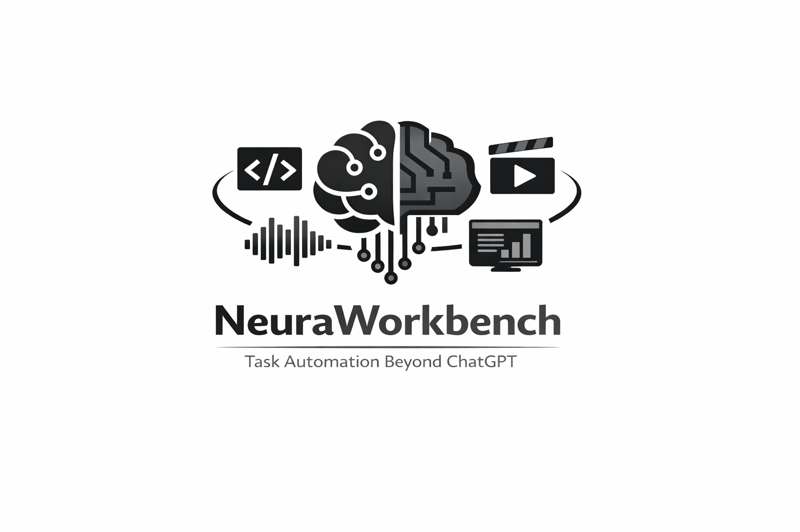

# NeuraWorkbench - Tools for Task Automation beyond ChatGPT

  

<h1 align="center">NeuraWorkbench</h1>

<i>Task Automation Beyond ChatGPT</i>

NeuraWorkbench is a growing collection of Python functions, tools, and scripts intended to make research and project work easier. 

The main idea is to use LLM-based preprocessing to turn raw inputs such as code, presentations, video, audio, and website content into cleaner intermediate representations that can be consumed by downstream AI agents, automation flows, or tools.

The repository is under active development. The current codebase is best understood as a practical workbench of reusable workflows rather than a finished end-user application.

## Current Workflows

- Codebase preprocessing and summarization
- PDF presentation slide extraction and image-based summarization
- Audio compression, transcription, and speech generation
- Video download, preprocessing and transcription workflows
- Browser automation and web-content collection
- Prompt/template assets for reusable preprocessing tasks

## Status

Implemented workflows already exist under `src/`, with example usage in `tests/`. Some parts are more mature than others, and several modules are still being refined or extended as new use cases come up.
